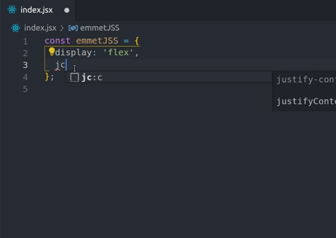

# Emmet-like JSS snippets
Work in progress.

## Usage

## Available snippets
### Flexbox
- `d:f` display: flex
- `ai:c` align-items: center
- `jc:c` justify-content: center

### Fonts
- `fs` font-size
- `ff` font-family
- `fw` font-weight

### Color
- `c` color

### Padding
- `p` padding
- `pr` padding-right
- `pl` padding-left
- `pt` padding-top
- `pb` padding-bottom

### Margin
- `m` margin
- `mr` margin-right
- `ml` margin-left
- `mt` margin-top
- `mb` margin-bottom

### Display
- `d:ib` display: inline-block
- `d:i` display: inline
- `d:n` display: none
- `d:b` display: block

### Visibility
- `v:h` visibility: hidden

### Overflow
- `ov:h` overflow: hidden
- `ov:v` overflow: visible
- `ov:s` overflow: scroll
- `ov:a` overflow: auto
- `ovx:h` overflow-x: hidden
- `ovx:v` overflow-x: visible
- `ovx:s` overflow-x: scroll
- `ovx:a` overflow-x: auto
- `ovy:h` verflow-y: hidden
- `ovy:v` overflow-y: visible
- `ovy:s` overflow-y: scroll
- `ovy:a` overflow-y: auto

### Cursor
- `cur:p` cursor: pointer

### Position
- `pos:r` position: relative
- `pos:a` position: absolute
- `pos:s` position: static
- `pos:f` position: fixed

## For more information
- Reference: [Emmet cheat sheet](https://docs.emmet.io/cheat-sheet/)
